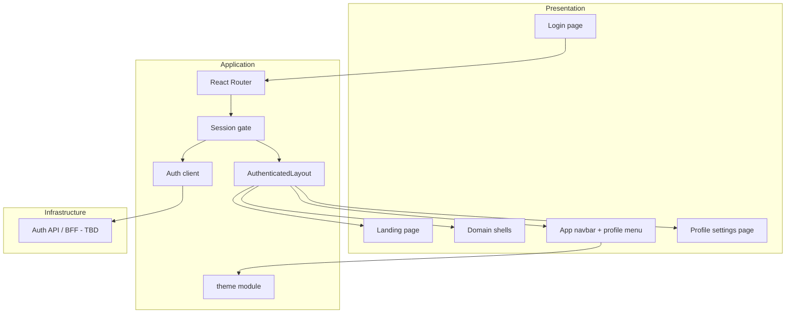

# Architecture  — Fleet 360

## Design Paradigm

**Layered single-page application (SPA)** on Vite + React:

| Layer | Location | Responsibility |
| --- | --- | --- |
| Presentation | `src/pages/*`, co-located `*.css` | Figma-aligned UI, local form state |
| Application | `src/App.jsx`, `src/layouts/*`, `src/auth/*`, `src/api/*` | Navigation, session gate, chrome, use-cases |
| Shared UI chrome | `src/components/` (navbar, profile menu) | Authenticated shell only; no auth secrets |
| Preferences | `src/theme/` | Theme resolution + persistence (non-secret) |
| Design tokens | `src/styles/fleet-tokens.css` | Colors, radii, fonts (`{DESIGN.md}` deltas) |
| Static assets | `src/assets/fleet360/*` | Committed Figma exports (logos, icons, hero) |
| Tooling | `vite.config.js` | Dev server, ACL markdown middleware (orthogonal to product runtime) |



## Invariants & Rules

### AD-1 — Canonical routes [ADOPTED]

- **Binds:** FR-2, FR-5, FR-6, EXPERIENCE.md IA
- **Prevents:** Duplicate or ambiguous URLs for the same screen
- **Rule:** Public `/login`, `/forgot-password`. Post-auth hub at `/home`. Profile settings at `/profile`. Domain shells at `/devices`, `/sites`, `/users`. `/` redirects to `/login`.

### AD-2 — Session gate before hub [ADOPTED]

- **Binds:** FR-2, FR-7, FR-9, FR-11, FR-13
- **Prevents:** Unauthenticated access to Landing, chrome, profile, and domain routes
- **Rule:** `/home`, `/profile`, `/devices`, `/sites`, `/users` require a valid session. Missing or expired session redirects to `/login` with optional flash message. Until backend exists, a minimal client session record is allowed only behind the auth stub and must be replaced before production.

### AD-3 — Auth token storage

- **Binds:** FR-2, PRD addendum security note
- **Prevents:** Passwords or long-lived tokens in `localStorage` / plain JS globals
- **Rule:** Prefer **httpOnly, Secure, SameSite** session cookie set by auth API. If bearer tokens are required, keep access token in memory; refresh via httpOnly cookie. Never persist passwords. **Theme preference** and other non-secret UI prefs may use `localStorage` (see AD-9). Session identity fields (e.g. email display) may live in the same `sessionStorage` session record as expiry — not in `localStorage`.

### AD-4 — Presentation vs domain logic

- **Binds:** all FRs at MVP
- **Prevents:** API calls and session logic embedded in page components
- **Rule:** Pages compose UI only. Auth and HTTP live in `src/auth/` and `src/api/`. Theme resolution lives in `src/theme/`. Router and guards live in `src/App.jsx` or `src/routes/`. Navbar/profile menu are presentational components; sign-out and session reads call `src/auth/` only (no inline `sessionStorage` in components).

### AD-5 — Design fidelity and assets

- **Binds:** FR-5, FR-8, DESIGN.md
- **Prevents:** Re-drawn icons/logos diverging from Figma
- **Rule:** Use committed files under `src/assets/fleet360/`. New screens import Figma via MCP export into that tree; document in UX `imports/figma-asset-manifest.md`.

### AD-6 — Styling system

- **Binds:** UX DESIGN tokens
- **Prevents:** One-off hex values scattered without token linkage
- **Rule:** Shared tokens in `fleet-tokens.css` (`--fleet-*`). Page-specific layout in page CSS files. No Tailwind unless AD is amended.

### AD-7 — Error and loading shape (auth)

- **Binds:** FR-2, FR-3
- **Prevents:** Inconsistent auth failure UX
- **Rule:** API errors map to `{ code, message }` at the client boundary; Login shows a single user-safe message for invalid credentials (no field-level leak).

### AD-8 — Authenticated layout chrome [ADOPTED]

- **Binds:** FR-9, FR-10
- **Prevents:** Navbar duplicated per page or shown on guest routes
- **Rule:** `AuthenticatedLayout` wraps all `RequireAuth` child routes. It renders **App navbar** (with profile control) above `<Outlet />`. Guest routes (`GuestOnly`) never import navbar components. Navbar is sticky/top-aligned; page content scrolls beneath.

### AD-9 — Theme preference

- **Binds:** FR-12, AD-3, AD-6
- **Prevents:** Per-page theme hacks; storing credentials with theme
- **Rule:** Canonical storage key `fleet360.theme` in `localStorage` with enum `light` | `dark` | `system`. Module `src/theme/` exposes `getTheme()`, `setTheme()`, `applyThemeToDocument()`, and optional `useTheme()` hook. Apply via `data-theme` on `document.documentElement` (or class) mapped to CSS variables in `fleet-tokens.css`. Login/Forgot Password may ignore stored theme or apply light-only until guest screens gain dark tokens — authenticated routes must honor preference.

### AD-10 — Profile menu and settings route

- **Binds:** FR-10, FR-11
- **Prevents:** Profile actions scattered; modal-only settings with no URL
- **Rule:** Profile dropdown component lives under `src/components/` (e.g. `ProfileMenu.jsx`). Menu items: **Profile settings** → navigate to `/profile`; **Theme** → cycles or toggles theme via AD-9 (may also offer control on profile page); **Sign out** → AD-11. `/profile` is a protected page (`pages/ProfileSettings.jsx`) showing signed-in email/label from `getSessionIdentity()` in `src/auth/session.js`. No password fields on this page in MVP.

### AD-11 — Sign out

- **Binds:** FR-13, AD-2, AD-3
- **Prevents:** Partial logout leaving protected UI visible
- **Rule:** `signOut()` in `src/auth/` calls `clearSession()` and returns; caller navigates to `/login` with `replace: true`. Optional reason `logout` for messaging. No auth artifacts in `localStorage` after sign out (theme key may remain).

## Consistency Conventions

| Concern | Convention |
| --- | --- |
| Naming (routes, files) | kebab URL segments; PascalCase page components (`Login.jsx`) |
| Data & formats | ISO 8601 dates in APIs; user-facing copy per EXPERIENCE.md |
| State & cross-cutting | React state + router for UI; server session for auth; theme via AD-9; env via `import.meta.env` |
| Accessibility (chrome) | Profile button `aria-haspopup="menu"`; menu keyboard per WAI-ARIA disclosure pattern |
| Errors | User-safe messages on Login; log technical detail only in dev console |
| Config | `VITE_*` for client-visible endpoints; secrets never in repo |

## Stack

| Name | Version |
| --- | --- |
| Node (dev) | 20+ LTS [ASSUMPTION: team standard] |
| React | 19.2.x |
| react-router-dom | 7.18.x |
| Vite | 8.3.x |
| oxlint | 1.81.x |
| React Compiler (babel plugin) | 1.0.x |

Auth API / IdP: **deferred** (see Deferred).

## Structural Seed

```text
src/
  main.jsx              # BrowserRouter root; bootstrap theme apply
  App.jsx               # Route table + guards
  layouts/
    AuthenticatedLayout.jsx   # Navbar + Outlet
  components/
    AppNavbar.jsx + AppNavbar.css
    ProfileMenu.jsx
  index.css             # Global reset + token import
  styles/
    fleet-tokens.css    # + dark theme token overrides
  pages/
    Login.jsx + Login.css
    Landing.jsx + Landing.css
    ProfileSettings.jsx + ProfileSettings.css
    Placeholder.jsx     # Shell pattern until domain modules exist
  assets/fleet360/      # Figma exports
  auth/                 # session, guards, loginUser, signOut
  theme/                # AD-9 preference module
  api/                  # fetch wrapper, auth endpoints
```

**Deployment (MVP):** static `dist/` from `vite build`; served by CDN or static host. Auth API hosted separately; CORS/cookie domain aligned with AD-3.

## Capability → Architecture Map

| Capability / FR | Lives in | Governed by |
| --- | --- | --- |
| Login form FR-1, FR-4 | `pages/Login` | AD-5, AD-6 |
| Authenticate FR-2 | `auth/` + `api/` | AD-2, AD-3, AD-7 |
| Forgot password FR-3 | `pages/Placeholder` → future `ForgotPassword` | AD-1, AD-4 |
| Landing hub FR-5–FR-7 | `pages/Landing` | AD-1, AD-2, AD-5 |
| ACL branding FR-8 | `Login` assets | AD-5 |
| Devices / Sites / Users entry | `Placeholder` shells | AD-1, AD-4 |
| App navbar FR-9 | `layouts/AuthenticatedLayout`, `components/AppNavbar` | AD-8 |
| Profile menu FR-10 | `components/ProfileMenu` | AD-8, AD-10 |
| Profile settings FR-11 | `pages/ProfileSettings`, `auth/session` identity | AD-1, AD-10 |
| Theme FR-12 | `theme/*`, `fleet-tokens.css` | AD-9, AD-6 |
| Sign out FR-13 | `auth/signOut` + router | AD-11, AD-2 |

## Deferred

| Item | Reason |
| --- | --- |
| SSO / enterprise IdP | Not in PRD v1 UI; revisit when pilot customer named |
| Real Devices/Sites/Users modules | Out of MVP PRD scope |
| RTU telemetry, dashboards | Phase 2+ Figma evidence only |
| Shared component library (buttons, inputs) | Extract when third consumer beyond Login/navbar needs reuse |
| Profile API (update name, avatar, locale) | FR-11 MVP is read-only identity |
| Org-enforced theme / white-label skins | PRD non-goal |
| E2E test stack | After auth API contract frozen |
| i18n | English-only MVP per PRD |
